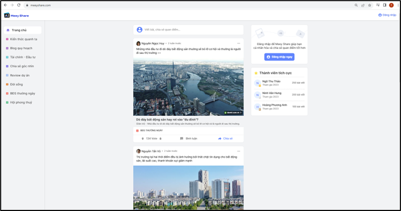

# Giao diện trang chủ Meey Share

### **1.     Truy cập Meey Share**

Người dùng nhập website: [https://meeyshare.com/](https://meeyshare.com/) trên các trình duyệt để truy cập vào website của Meey Share.

Sau khi truy cập website, giao diện trang chủ được hiển thị như hình bên dưới:

<figure><figcaption>
Hình 1: Giao diện trang chủ Meey Share
</figcaption></figure>

### 2.     Giới hiệu về giao diện trang chủ

.png>) Logo Meey Share, đồng thời khi bấm vào logo, người dùng đều được điều hướng về trang chủ.

.png>) là nơi người dùng đăng nhập tài khoản hoặc mở tài khoản Meey ID.

Các trường Chuyên mục: là nơi sắp xếp và phân loại các bài viết theo đúng chuyên mục của người đăng bài viết, điều này khiến người đọc dễ lựa chọn đúng với nhu cầu hơn.

<figure><figcaption>
Hình 2: Các trường chuyên mục bài viết
</figcaption></figure>

Viết bài, chia sẻ quan điểm…: để thực hiện được chức năng này, yêu cầu người dùng cần Đăng nhập tài khoản và sau đó người dùng có thể vào đây để chia sẻ bài viết lên nền tảng Meey Share.

<figure><figcaption>
Hình 3: Tính năng viết bài, chia sẻ quan điểm trên Meey Share
</figcaption></figure>

Đăng nhập/ Đăng ký: người dùng bấm vào “Đăng nhập ngay” như hình bên dưới hoặc có thể bấm vào .png>) ở góc trên cùng bên phải của website.

<figure><figcaption>
Hình 4: Nút đăng nhập ngay
</figcaption></figure>

Thành viên tích cực: hiển thị 3 thành viên đăng bài và chia sẻ bài tích cực nhất

<figure><figcaption>
Hình 5: Hiển thị top các thành viên đăng bài và chia sẻ tích cực nhất
</figcaption></figure>

Bài đăng tin: là bài đăng người dùng muốn chia sẻ, và bài đăng được gắn vào các trường phù hợp ở thanh Chuyên mục.

Người xem có thể xem chi tiết bài đăng/ vote/ bình luận hoặc chia sẻ bài đăng.

<figure><figcaption>
HÌnh 6: Xem chi tiết bài đăng/vote/bình luận hoặc chia sẻ bài đăng
</figcaption></figure>

Xem tin gần bạn: người dùng cho phép định vị và chức năng này tự động cập nhật bài đăng khi người dùng di chuyển đến vị trí khác thì các bài đăng tại vị trí người dùng đến sẽ được cập nhật và hiển thị.

<figure><figcaption>
Hình 7: Xem tin gần bạn
</figcaption></figure>
